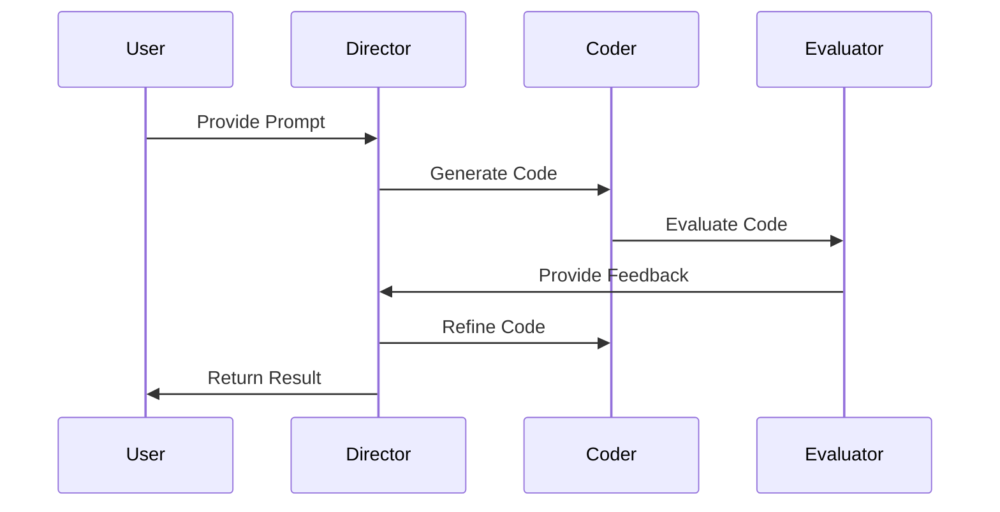

# 🤖 Code Generation Guide

Learn how to use aiden's AI-powered code generation capabilities to accelerate your development process.

## 📑 Table of Contents

- [Overview](#overview)
- [Code Director](#code-director)
- [Spec Generator](#spec-generator)
- [Best Practices](#best-practices)
- [Examples](#examples)

## 🌟 Overview

aiden provides two powerful tools for code generation:

1. **Code Director**: AI-powered code generation with iterative refinement
2. **Spec Generator**: Feature specification generation from templates

## 🎯 Code Director

### Architecture



### Configuration

```yaml
# director_config.yml
prompt: "Create a REST API endpoint"
coder_model: "gpt-4"
evaluator_model: "gpt-4o"
max_iterations: 5
execution_command: "python {file}"
context_editable:
  - "app/api/endpoints.py"
context_read_only:
  - "app/models.py"
  - "app/database.py"
evaluator: "default"
```

### Usage

```bash
# Create configuration
aiden create-director-config config.yml \
  --prompt "Create user authentication" \
  --coder-model "gpt-4" \
  --max-iterations 5

# Run code generation
aiden run-director config.yml --verbose
```

### Voice Commands

```text
"Generate code for user authentication"
"Create API endpoint for user registration"
"Implement database models for blog posts"
```

## 📝 Spec Generator

### Feature Templates

```yaml
# auth_feature.yml
name: "Authentication"
type: "feature"
components:
  - name: "UserModel"
    type: "model"
    fields:
      - name: "username"
        type: "string"
      - name: "email"
        type: "string"
      - name: "password_hash"
        type: "string"
  
  - name: "AuthController"
    type: "controller"
    endpoints:
      - path: "/login"
        method: "POST"
      - path: "/register"
        method: "POST"
```

### Usage

```bash
# List available templates
aiden list-spec-templates

# Generate specification
aiden generate-spec auth-feature \
  --template auth.yml \
  --output-dir specs/

# Create custom template
aiden create-spec-template custom.yml
```

## 🌟 Best Practices

### Code Generation

1. **Clear Prompts**
   ```yaml
   # Good
   prompt: "Create a REST API endpoint for user registration with email validation"
   
   # Bad
   prompt: "Make user signup"
   ```

2. **Proper Context**
   ```yaml
   context_editable:
     - "app/api/users.py"  # Main file to edit
   context_read_only:
     - "app/models.py"     # Required context
     - "app/config.py"     # Configuration
   ```

3. **Iteration Control**
   ```yaml
   max_iterations: 5       # Prevent infinite loops
   evaluation_criteria:
     - "code_style"
     - "functionality"
     - "security"
   ```

### Spec Generation

1. **Template Organization**
   ```
   specs/
   ├── features/
   │   ├── auth.yml
   │   └── payment.yml
   ├── components/
   │   ├── user.yml
   │   └── product.yml
   └── patterns/
       ├── repository.yml
       └── factory.yml
   ```

2. **Pattern Usage**
   ```yaml
   patterns:
     - "repository"    # Data access
     - "factory"       # Object creation
     - "observer"      # Event handling
   ```

## 💡 Examples

### REST API Endpoint

```yaml
# Input Configuration
prompt: |
  Create a REST API endpoint for user registration with:
  - Email validation
  - Password strength check
  - Duplicate user check
  - Error handling

context_editable:
  - "app/api/auth.py"
context_read_only:
  - "app/models/user.py"
  - "app/utils/validation.py"
```

Generated Code:
```python
from fastapi import APIRouter, HTTPException
from pydantic import BaseModel, EmailStr
from app.models.user import User
from app.utils.validation import validate_password

router = APIRouter()

class UserRegistration(BaseModel):
    email: EmailStr
    password: str
    username: str

@router.post("/register")
async def register_user(user: UserRegistration):
    # Check existing user
    if await User.get_by_email(user.email):
        raise HTTPException(400, "Email already registered")
    
    # Validate password
    if not validate_password(user.password):
        raise HTTPException(400, "Password too weak")
    
    # Create user
    new_user = await User.create(**user.dict())
    return {"id": new_user.id, "message": "Registration successful"}
```

### Database Model

```yaml
# Input Configuration
prompt: |
  Create a SQLAlchemy model for a blog post with:
  - Title, content, author
  - Created/updated timestamps
  - Tags relationship
  - Comment relationship

context_editable:
  - "app/models/post.py"
```

Generated Code:
```python
from sqlalchemy import Column, Integer, String, Text, ForeignKey, Table
from sqlalchemy.orm import relationship
from app.database import Base
from datetime import datetime

post_tags = Table(
    'post_tags',
    Base.metadata,
    Column('post_id', Integer, ForeignKey('posts.id')),
    Column('tag_id', Integer, ForeignKey('tags.id'))
)

class Post(Base):
    __tablename__ = 'posts'
    
    id = Column(Integer, primary_key=True)
    title = Column(String(200), nullable=False)
    content = Column(Text, nullable=False)
    author_id = Column(Integer, ForeignKey('users.id'))
    created_at = Column(DateTime, default=datetime.utcnow)
    updated_at = Column(DateTime, onupdate=datetime.utcnow)
    
    author = relationship("User", back_populates="posts")
    tags = relationship("Tag", secondary=post_tags)
    comments = relationship("Comment", back_populates="post")
```

## 🔍 Troubleshooting

### Common Issues

1. **Poor Code Quality**
   - Use more specific prompts
   - Increase max_iterations
   - Provide better context

2. **Generation Failures**
   - Check API keys
   - Verify file permissions
   - Review error messages

3. **Performance Issues**
   - Reduce context size
   - Use faster models
   - Optimize templates

## 📚 Resources

- [OpenAI Documentation](https://platform.openai.com/docs)
- [Code Generation Best Practices](./best-practices.md)
- [Template Gallery](./templates/)
