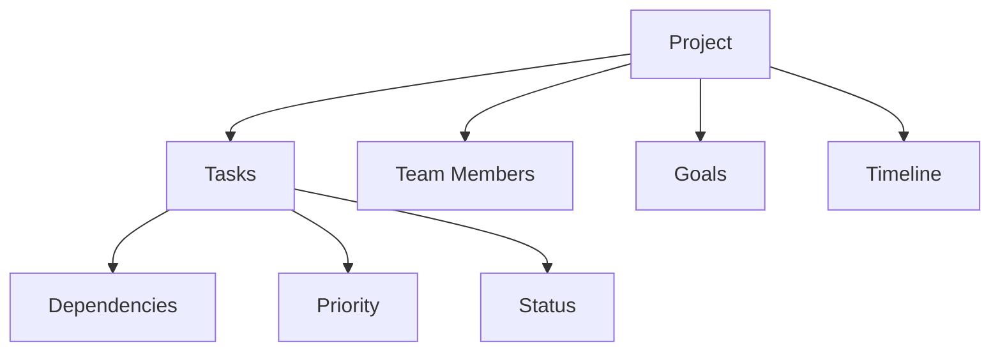
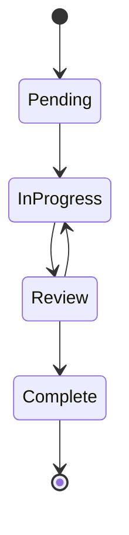

# 📊 Project Management Guide

Learn how to effectively manage projects, tasks, and teams using aiden.

## 📑 Table of Contents

- [Project Structure](#project-structure)
- [Creating Projects](#creating-projects)
- [Task Management](#task-management)
- [Team Collaboration](#team-collaboration)
- [Progress Tracking](#progress-tracking)
- [Best Practices](#best-practices)

## 🏗️ Project Structure

### Project Components



### Data Model

- **Projects**
  - ID, Name, Description
  - Owner, Status, Priority
  - Start Date, Due Date
  - Created At, Updated At

- **Tasks**
  - ID, Name, Description
  - Project ID, Assignee
  - Priority, Status
  - Dependencies, Timeline

## 🚀 Creating Projects

### Via Voice Commands

```text
"Create a new project called [name]"
"Set project description to [description]"
"Set project priority to [1-5]"
"Set project due date to [date]"
```

### Via CLI

```bash
# Create new project
aiden create-project "Website Redesign" \
  --description "Modernize company website" \
  --priority 1 \
  --due-date "2024-12-31"

# List projects
aiden list-projects

# Show project details
aiden show-project 1
```

## ✅ Task Management

### Task States



### Creating Tasks

```bash
# Add task to project
aiden create-task "Implement login" \
  --project "Website Redesign" \
  --priority 2 \
  --assignee "john_doe"

# List tasks
aiden list-tasks --project "Website Redesign"
```

### Task Dependencies

```bash
# Add task dependency
aiden add-dependency \
  --task "Implement login" \
  --depends-on "Setup database"
```

## 👥 Team Collaboration

### User Roles

- **Owner**: Full project control
- **Manager**: Assign tasks, update status
- **Developer**: Work on tasks
- **Viewer**: Read-only access

### Managing Team Members

```bash
# Add team member
aiden add-member \
  --project "Website Redesign" \
  --user "jane_doe" \
  --role "developer"

# List team members
aiden list-members --project "Website Redesign"
```

## 📈 Progress Tracking

### Project Status

```bash
# View project status
aiden project-status "Website Redesign"

# Generate progress report
aiden generate-report \
  --project "Website Redesign" \
  --format "markdown"
```

### Task Analytics

```bash
# View task completion rate
aiden task-analytics \
  --project "Website Redesign" \
  --metric "completion_rate"

# View time estimates
aiden task-analytics \
  --metric "time_tracking"
```

## 🌟 Best Practices

### Project Planning

1. **Clear Objectives**
   - Define measurable goals
   - Set realistic timelines
   - Identify key stakeholders

2. **Task Organization**
   - Break down into smaller tasks
   - Set clear priorities
   - Define dependencies

3. **Team Communication**
   - Regular status updates
   - Clear task assignments
   - Document decisions

### Project Templates

Use project templates for common scenarios:

```bash
# Create from template
aiden create-project "Mobile App" \
  --template "mobile-app" \
  --team "mobile-team"
```

Available templates:
- Web Development
- Mobile App
- API Service
- Database Migration
- UI/UX Design

## 🔄 Workflow Integration

### Git Integration

```bash
# Link project to repository
aiden link-repo \
  --project "Website Redesign" \
  --repo "github.com/company/website"

# Track commits
aiden track-commits --project "Website Redesign"
```

### CI/CD Pipeline

```bash
# Configure deployment
aiden setup-pipeline \
  --project "Website Redesign" \
  --type "web-deploy"
```

## 📊 Reporting

### Available Reports

- Project Overview
- Task Status
- Team Performance
- Time Tracking
- Risk Analysis

### Generate Reports

```bash
# Generate comprehensive report
aiden generate-report \
  --project "Website Redesign" \
  --type "comprehensive" \
  --format "pdf"
```

## 🔍 Advanced Features

### Custom Fields

```bash
# Add custom field
aiden add-field \
  --project "Website Redesign" \
  --name "client_id" \
  --type "string"
```

### Automation Rules

```bash
# Create automation rule
aiden create-rule \
  --project "Website Redesign" \
  --when "task.status = 'complete'" \
  --do "notify_slack"
```

## 🆘 Support

- Run `aiden project-help` for assistance
- Check [documentation](README.md)
- Join [community forum](https://forum.aiden.dev)
- Email: support@aiden.dev
